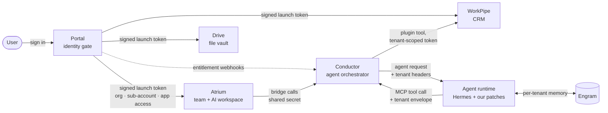

# Orbit

**A multi-tenant, agent-native business platform — five apps behind one identity gate, an agent
orchestrator and an agent runtime — built by one engineer working with a team of AI agents.**

> **About this edition.** Most of this work lives in private repositories that can't be made
> public. So that it can be reviewed, I assembled this curated public edition: the real code and
> real commit history, with business names, customer data, credentials, pricing and internal
> planning documents removed. Nothing was rewritten to look better — the scrub replaced
> identifiers and removed sensitive files, and every step of it is described
> [below](#how-this-edition-was-made).

| | |
|---|---|
| **Shipped** | 216 merged pull requests — **148 in the last 90 days** ([ship log](docs/SHIPLOG.md)) |
| **Built with** | Claude Code, Codex and an orchestrator agent running on OpenClaw — see [the factory](factory/README.md) |
| **Speed** | Wiring five apps behind one identity gate: 50 PRs in ~8 weeks, against my own solo estimate of 6–9 months — [the list](docs/VELOCITY.md) |
| **Agents in production** | A tenant-scoped assistant with tools and per-tenant memory, and an onboarding flow where the model suggests and a person confirms |

## Start here — a 10-minute tour

1. **[`factory/README.md`](factory/README.md)** — how this is built: an orchestrator agent, delegated
   coding agents, written protocols and explicit human checkpoints.
2. **[`apps/agent-runtime/patches/0001-…`](apps/agent-runtime/patches/)** — tenant identity for agent
   tool calls: built from the request's headers, hidden from the tool schema the model sees, and the
   call is blocked if it's missing.
3. **[`apps/conductor/…/hermes-openai/execute.ts`](apps/conductor/server/src/adapters/hermes-openai/execute.ts)**
   — the orchestrator's side of that contract: every agent request carries company, sub-account, run
   and agent identity.
4. **[`apps/conductor/packages/mcp-server/src/plugin-tools.ts`](apps/conductor/packages/mcp-server/src/plugin-tools.ts)**
   — how app capabilities (e.g. CRM lookups) become agent tools, with the tool's tenant context taken
   from that envelope rather than from the model.
5. **[`apps/conductor/server/src/routes/bridge-role-map.ts`](apps/conductor/server/src/routes/bridge-role-map.ts)**
   — an LLM suggests which specialist agents a new business needs; its output is validated against a
   fixed set of roles, there's a deterministic fallback, and nothing is created until a person confirms.
6. **[`apps/portal/src/app/api/auth/token/route.ts`](apps/portal/src/app/api/auth/token/route.ts)** —
   the identity gate: one signed token carries organization, sub-account and app entitlements to every app.
7. **[`apps/workpipe/src/lib/authz.ts`](apps/workpipe/src/lib/authz.ts)** — the ownership guards that
   closed a class of cross-tenant access bugs in the CRM.
8. **[`apps/drive/src/lib/encryption.ts`](apps/drive/src/lib/encryption.ts)** — envelope encryption:
   a random key per file, wrapped by a per-tenant key.
9. **[`docs/case-studies/agent-system.md`](docs/case-studies/agent-system.md)** — the agent system end to end: what it does, how it's orchestrated, how I know it works, and the incidents that shaped it.
10. **[`docs/SHIPLOG.md`](docs/SHIPLOG.md)** — every merged PR, with dates.

## Architecture



**Identity.** Portal is the single front door. A user signs in once; Portal resolves their
organization, sub-account and which apps they're entitled to, and launches each app with a signed
token carrying exactly that. Apps provision themselves from the token on first launch, so a new
organization appears everywhere without a sync job. Entitlement changes reach the orchestrator by
webhook.

**A request to the assistant.** Atrium forwards chat to Conductor over an authenticated bridge.
Conductor resolves the tenant's own assistant agent and calls the runtime once, stamping the
request with tenant headers. The runtime runs the agent loop; when the agent uses a tool, the runtime
attaches a tenant envelope the model never sees, and Conductor's MCP server executes the tool in that
tenant's context — tools scoped to a sub-account fail closed without one. Memory (Engram) is
partitioned per company and filtered per sub-account, and refuses to operate without a scope.

## The apps

| App | What it does | Built on | Worth a look |
|---|---|---|---|
| [Portal](apps/portal) | Identity, organizations, sub-accounts, entitlements, admin | Next.js, Clerk, Prisma | The launch token and entitlement model; license mode |
| [Atrium](apps/atrium) | Workspace where a team works with its AI staff; onboarding | Open WebUI | Onboarding: context capture → memory seeding → agent provisioning |
| [Conductor](apps/conductor) | Agent orchestrator: per-tenant assistants, specialists, tools | Paperclip | Bridge routes, tool plugins, the tenant contract |
| [WorkPipe](apps/workpipe) | CRM: pipelines, contacts, funnels, invoices, files | Next.js, Prisma | Full commit history; ownership guards |
| [Drive](apps/drive) | Per-tenant file storage and sharing | Next.js, object storage | Envelope encryption; per-tenant storage |
| [Agent runtime](apps/agent-runtime) | Runs the agents | Hermes Agent | Two small patches and a memory plugin |

## Adopt before build

Where the work wasn't core, I adopted strong open-source projects and extended them rather than
building my own: **Open WebUI** for the workspace, **Paperclip** for agent orchestration, **Hermes
Agent** for the runtime, **Mem0** and **Qdrant** for memory. The effort went into what makes the
platform itself — the identity gate, the tenant contract across apps, the onboarding flow and the
CRM. Upstream licenses and attribution are kept ([NOTICE](NOTICE.md)).

Drive is the same judgment in the other direction: I first planned to integrate Google Drive, but
object storage was a better fit — it gave me the flexibility to allocate dedicated storage per
tenant.

## How it's built

I work with a small team of AI agents: an orchestrator that plans and delegates, coding agents that
implement on feature branches, and agents for review, operations and the runtime. They coordinate
through a file-based message queue and written protocols — verify before claiming anything,
exhaustive reference audits for breaking changes, a session changelog that feeds ADRs — and anything
consequential (sending email, touching money, write access, merging) waits for my approval.
The whole operating layer is in **[`factory/`](factory/README.md)**, including real handoffs where an
agent corrects its own earlier claim.

The clearest measure of what that changed: making Portal the single gate for five separate apps
(identity, launch tokens, entitlements with webhook sync, shared sub-accounts, per-tenant
provisioning and isolation) took **50 pull requests across all five repositories in the eight weeks from 2026-05-26 to
general availability on 2026-07-23** ([every one of them](docs/VELOCITY.md)). My own estimate for
building that solo, the way I worked before, is six to nine months — roughly 3–4.5× slower.

## Evals

[`evals/`](evals/README.md) runs the agent through the real runtime against fixed inputs and scores it
deterministically: 30 role-suggestion cases (including negations and prompt injection) and a memory
suite that seeds canary facts per tenant and fails on any cross-tenant recall.

Latest runs (Claude Sonnet 5): role suggestions 30/30 in four of six runs and 29/30 in the other two,
and **zero cross-tenant leaks** in all five memory runs since the fix, with recall at 4/4 in each except
one, where a tool-allowlist change broke recall and the evals caught it. The isolation fix itself came from the evals
themselves. The earlier runs leaked, and the cause turned out to be the runtime's built-in session
search, which had no tenant filter. Every run is committed, failures included:
[`evals/results/SUMMARY.md`](evals/results/SUMMARY.md).

## Repository layout

```
apps/
  portal/         identity gate            (full commit history)
  workpipe/       CRM                      (full commit history)
  drive/          file vault               (full commit history)
  atrium/         workspace, on Open WebUI (snapshot — see below)
  conductor/      orchestrator, on Paperclip (snapshot — see below)
  agent-runtime/  our changes to Hermes Agent
demo/             the live demo: compose stack, seeds, smoke test, nightly reset
evals/            agent evals and every result, failures included
factory/          how it's built: agent rules, protocols, scripts, real handoffs
docs/SHIPLOG.md   every merged pull request
scripts/          the scrub gate used by this edition
```

## How this edition was made

- **History.** Portal, WorkPipe and Drive keep their full commit history — real dates, real
  authorship. Commits map to my GitHub account; those written with Claude Code keep their
  `Co-Authored-By` trailer. Atrium and Conductor are forks of large upstream projects whose history isn't mine to
  republish, so they're single snapshots and their shipped work is listed in the
  [ship log](docs/SHIPLOG.md).
- **Scrub.** History was rewritten with `git filter-repo` to replace business names and identifiers,
  personal emails, production hostnames, tenant IDs and pricing. Product names were changed too (Atrium,
  Conductor and Engram are new names). Original pull-request numbers appear as `WP-`, `PT-`, `DR-`, `AT-`
  and `CD-` references.
- **Removed outright.** Internal planning documents (including a security audit), one-off production
  scripts, commercial billing code (Portal runs in license mode), and a file that once held a storage
  credential — removed from every commit, not just the latest.
- **Gates.** Every file and every commit passes a denylist check ([`scripts/scrub-check.sh`](scripts/scrub-check.sh),
  patterns kept private because a list of removed terms would itself disclose them) and two secret
  scanners — gitleaks, with a narrow allowlist of verified test fixtures, and trufflehog, where each
  finding was reviewed individually.

## Live demo

**[orbit-app.site](https://orbit-app.site)** runs the whole stack. Access is by invitation:
[request access](https://orbit-app.site/waitlist).

The demo business is **Harbor Supply Co.**, a fictional wholesale distributor with one location, a
small sales pipeline and a few customers. Things to try:

1. **Sign in to Portal**, the identity gate, and open **Atrium**, the workspace. Portal hands each app a
   signed token carrying the organization, location and app entitlements.
2. **Ask the assistant about the business**, for example *"Which deals are in our Wholesale Orders
   pipeline, and which is the biggest?"* It answers from the CRM through tool calls scoped to this
   business and location. It can't reach another tenant's data, because tool calls take their tenant
   identity from the request, not from the model.
3. **Ask it to hand something to the team**, for example *"Put together a follow-up plan to close the
   Greenleaf deal."* It files a ticket for the business's lead agent on the orchestrator's board
   (**Conductor**).
4. **Open WorkPipe** (the CRM) and **Drive** (the file vault) from Portal. They use the same sign-in and
   show the same business.

What's different from production: the data is fictional, and **everything resets nightly** (3am US
Eastern). The coding-agent CLIs that production agents use to work tickets are left out of the demo,
so handed-off tickets wait on the board rather than being worked. The assistant runs with the tool
lockdown described in [the case study](docs/case-studies/agent-system.md): only the CRM tools, with
no host access, no shared memory and no cross-session search.

## Running it

[`demo/`](demo/) runs everything on one machine with Docker Compose: one Postgres, a dedicated
vector store for memory, the agent runtime, and every port bound to localhost. The only public
entry is an outbound tunnel.

```bash
demo/build.sh                  # build every image, one at a time
demo/up.sh up -d               # start (env files are read from outside the repo; see demo/up.sh)
demo/seed.sh                   # orchestrator plugins, assistant template, API key, admin
demo/seed-demo-account.sh      # the demo business, through each app's own first-launch path
demo/smoke.sh                  # ask the assistant about the pipeline; pass only if it names a real deal
demo/reset.sh                  # drop all data and reseed (runs nightly)
```

`smoke.sh` is the end-to-end check. The first time it ran, it found three breaks between the
workspace and the CRM. All three failed closed, and the model covered each one with "which account
do you mean?" The fixes are in the commit that added it.

## License

Source-available for review; see [NOTICE](NOTICE.md) for terms and upstream licenses.
